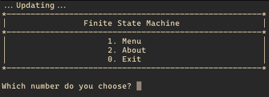
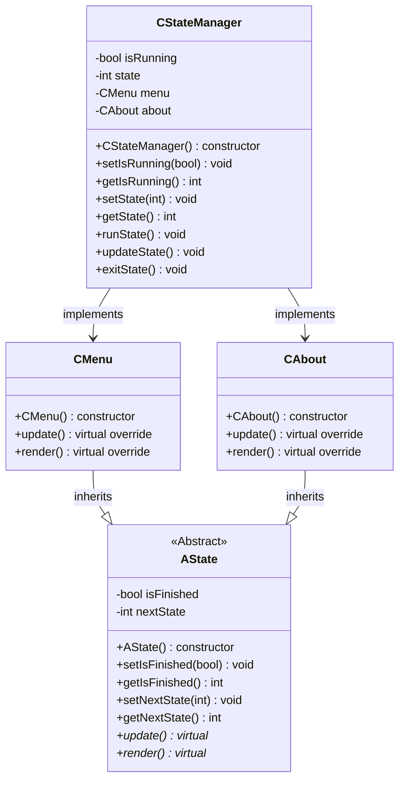
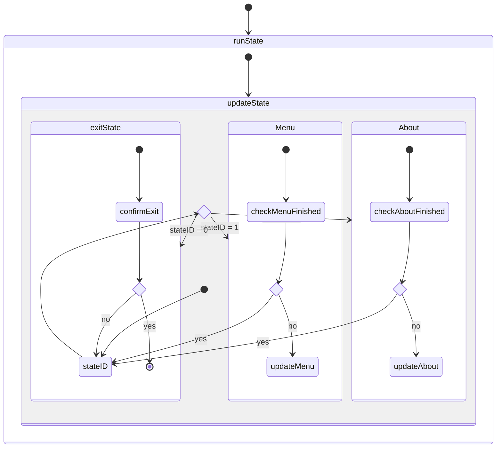

<h1 align="center">Finite State Machine</h1>

> Developed in [GCC](https://gcc.gnu.org/)

## Contents

-   [Project Configuration](#1-project-configuration)
-   [Features](#2-features)
-   [Class Diagram](#3-class-diagram)
-   [State Diagram](#4-state-diagram)

---

### 1. Project Configuration

-   GCC: 14.0.0

### 2. Features

Navigates between states (`Menu`, `About`, `Exit`).

### 3. Class Diagram

### 4. State Diagram

