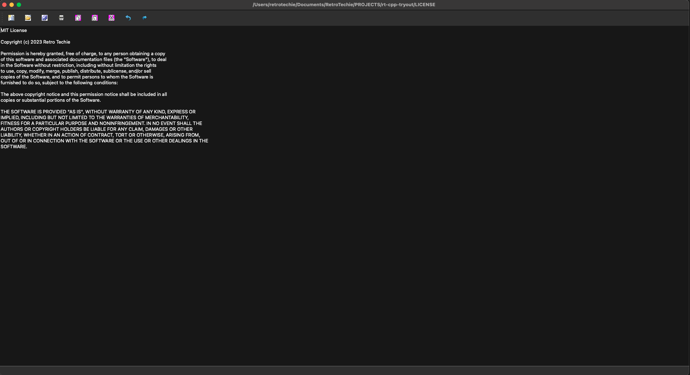

<h1 align="center">Notepad</h1>

> Developed in [Qt Open Source](https://www.qt.io/download-open-source)

## Contents

- [Project Configuration](#1-project-configuration)
- [Features](#2-features)

---

### 1. Project Configuration

- Qt Creator: 9.0.1
- Build: Desktop (arm_darwin_generic_mach_o_64bit) - qmake

### 2. Features

- File
  - New
  - Open
  - Save As
  - Print
  - Exit

- Edit
  - Copy
  - Paste
  - Cut
  - Undo
  - Redo
